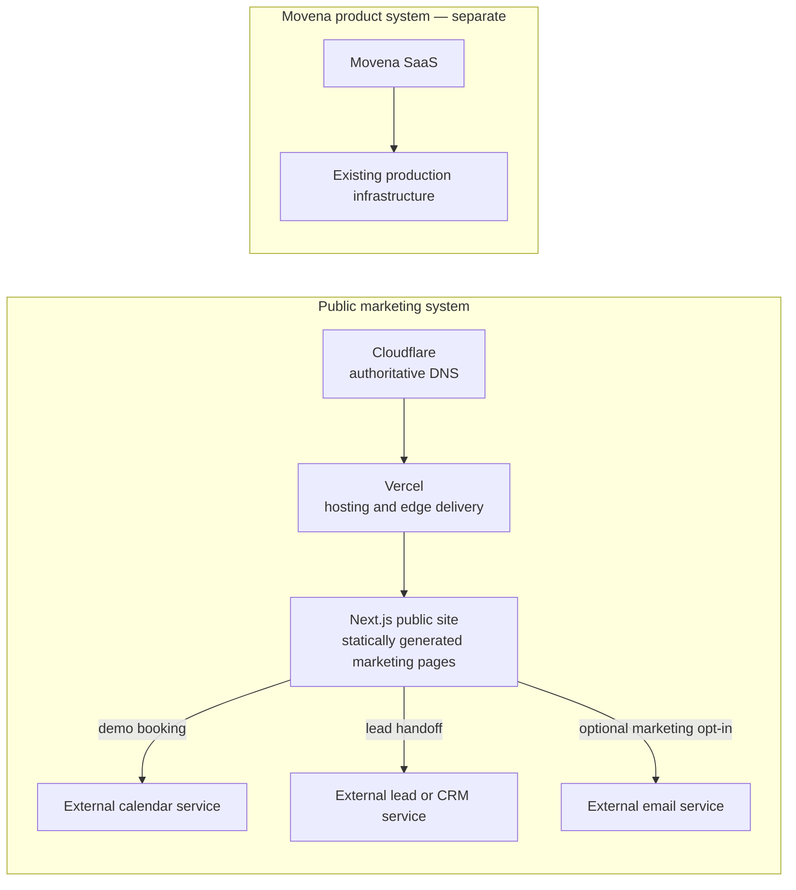

# Movena marketing site: discovery and redesign plan

**Status:** discovery only

**Date:** 30 August 2026

**Repository:** `prashbn/movena-site`, branch `main`, commit `580179c`
**Production domain:** `https://movena.com.au/`

No website, DNS, Cloudflare, GitHub Pages, Search Console, legal URL, deployment configuration, or Vercel project was changed as part of this work. The only repository change is this document.

## Content freeze — important

The existing approved Movena website copy is frozen. Do not rewrite, shorten,
expand, paraphrase, improve, modernise, or replace it. Preserve existing
headings, descriptions, calls to action, legal wording, and product claims
verbatim.

The redesign must improve visual design, typography, layout and spacing,
information presentation, product imagery, responsive behaviour, navigation,
interaction, motion where appropriate, and technical architecture around the
approved copy. It must not change the copy to suit the design.

If a newly shipped capability has no representation in the existing website
copy, record the gap as an open owner decision. Do not create replacement or
additional marketing copy without a separate instruction. Existing legal pages
and their wording remain strictly out of scope for content changes.

This content freeze supersedes any earlier recommendation in this document to
rewrite, expand, retire, or replace existing website wording. Those notes may
still inform placement and hierarchy, but not copy changes.

## Executive recommendation

Movena should be presented as the operating platform for modern fitness businesses: the system connecting the commercial operation of a gym with the training its coaches deliver and the performance context members create. The current site already contains unusually useful raw material—one member record, multi-location operations, programming, member-owned history, thoughtful privacy language, payments, and Kisi—but it gives too much homepage weight to individual mechanisms such as badges and too little to the breadth and connectedness of the platform.

For launch, do not create a separate page for every product area. Ship a focused public structure:

- Home
- Platform, with substantial anchored sections for operations, payments, programming, performance, member experience, access control, and integrations
- Member experience at the existing `/members/` URL
- About
- Contact, with “Book a demo” as the primary action
- Help at the existing `/help/` URL
- The existing Kisi page and exact legal routes

Defer dedicated Programming, Performance, Payments, Access Control, Integrations, and Pricing routes until each has enough verified product detail, real UI imagery, and commercial reason to stand alone. This gives Movena a credible launch without turning the redesign into a large content programme.

Use Next.js App Router with strict TypeScript and statically generated pages. Avoid a CMS, database, authentication, server rendering, marketing automation, or a bespoke lead backend at launch. Keep Cloudflare as the authoritative DNS provider, but plan for the apex and `www` web records to point directly to Vercel rather than stacking the Cloudflare reverse proxy in front of Vercel. Only the website records should change during the eventual cutover; mail, verification, app, and other DNS records must remain untouched.

## Discovery basis and limitations

The audit covered every tracked file on `main`, repository history, current public route responses, public DNS, live page output, asset dimensions and use, and the complete shared stylesheet. The repository working tree was clean before this document was added.

The in-app browser was unavailable, so an interactive visual test at multiple live viewport widths was not possible in this session. Responsive findings below are based on the complete CSS breakpoint audit and live HTML, not on a claim that every viewport was visually signed off. A real-device and browser matrix remains a pre-launch requirement.

The GitHub Pages REST metadata endpoint was not publicly accessible, so the exact Pages setting cannot be proven from the API. The root `CNAME`, root HTML files, absence of a Pages workflow, live GitHub response headers, and direct GitHub Pages fallback are consistent with branch-based publication from the repository contents. That setting must be confirmed in GitHub before migration.

## 1. Current-state architecture

### Repository and build structure

There is no application framework or conventional build pipeline.

| Area | Current state | Consequence |
| --- | --- | --- |
| Framework | None; hand-authored HTML and CSS | Every page repeats its shell and metadata. |
| Language | HTML, CSS, and one CommonJS Node script | No TypeScript, React, component model, or typed content. |
| Package/tooling | No `package.json`, lockfile, linter, formatter, test runner, or CI workflow | There is no automated build or quality gate. |
| Pages | Seven `index.html` files in directory routes | GitHub Pages supplies directory routing and slash redirects. |
| Styling | One 698-line `assets/site.css` | A coherent but globally coupled design system. |
| Cache busting | `tools/stamp-css.js` writes a content hash into stylesheet URLs | Manual step created after a production stale-CSS incident. |
| Publishing | Repository content plus root `CNAME` | Consistent with GitHub Pages branch publication. |
| Dynamic behavior | None | All pages are static; contact actions are `mailto:` links. |

The cache-stamping script intentionally updates six pages but omits `integrations/kisi/index.html`. The Kisi page uses a manual `?v=kisi-ol-1` stylesheet suffix instead. This means a future CSS change can update the main pages while leaving the integration page on a stale cache key.

Git history contains 33 commits beginning 10 May 2026. The current light editorial redesign, marketing pages, photography, badges, cache stamping, legal pages, help page, and Kisi page were all added incrementally. One larger coaching photo was deleted after a recrop; no previously published routes were found in history beyond the seven that remain.

### Current delivery path

The observed production path is:

`Visitor → Cloudflare proxy → GitHub Pages/Fastly → static repository file`

Evidence from live headers includes `server: cloudflare`, `x-github-request-id`, `x-github-edge-region`, `via: varnish`, and GitHub/Fastly cache headers. HTML currently has a 10-minute cache instruction and static assets can be cached for four hours. Cloudflare also injects its email-obfuscation script into the live homepage.

The root `CNAME` contains exactly `movena.com.au`. No `.github/workflows`, `_config.yml`, `_redirects`, `vercel.json`, or other hosting configuration exists in the repository.

### Domain and DNS observations

- Authoritative nameservers are Cloudflare.
- The apex, `www`, and `app` hostnames currently resolve through Cloudflare proxy addresses, so their origin records are not visible in public DNS.
- `www.movena.com.au` redirects permanently to `https://movena.com.au/`.
- `app.movena.com.au` is publicly proxied by Cloudflare and must be treated as a separate production system. It is not part of this website migration.
- Mail is routed through iCloud.
- Public TXT records include SPF, Apple domain verification, Brevo verification, and two Google site-verification records.
- A DMARC record is present.

The eventual website cutover must change only the intended apex/`www` web records. It must not replace the zone, nameservers, MX, SPF, DMARC, Apple, Brevo, Google verification, `app`, or any unobserved application/service records.

### Navigation and shell

Marketing pages use a sticky translucent header with:

- text-rendered `Movena` logomark plus a CSS blue dot;
- Platform, For members, and Help links;
- a right-side CTA: Talk to us on Home and Platform, Get help on Members.

Document pages show the same text logomark and only “Back to site” in the header. All pages share footer links to Platform, For members, Help, Privacy, and Terms, plus `Movena Pty Ltd (ACN 700 863 618)`. Marketing footers add “Made in Australia”.

At widths below 800px, all primary navigation links are hidden and there is no mobile menu. Only the logo and CTA remain. Footer navigation wraps. This is functional but makes product and support discovery materially weaker on mobile.

### Fonts, tokens, and current visual system

The site loads Geist weights 300–700 and Geist Mono weights 400–500 from Google Fonts on every page.

Core tokens include:

- white background, ink `#14161B`, muted ink `#59606B`;
- cobalt accent `#2F54D0` and darker hover `#2646B4`;
- 16px and 12px radii;
- pale blue, violet, sage, and mint section washes;
- green success and amber warning states;
- dark navy member-app and badge surfaces;
- restrained card, lift, and deep shadows.

The CSS includes good foundations: fluid type with `clamp()`, visible focus states, a reduced-motion mode, responsive image reservations, semantic colour tokens, print handling for documents, and a marketing-page skip link. Document pages do not have the skip link.

Responsive behavior is implemented entirely in CSS:

- the main container is 1,120px with 40px desktop and 22px mobile gutters;
- two-column narrative rows stack below 900px;
- four-column feature grids become two columns below 980px and one below 560px;
- capability grids and three-column narrative grids become one column below 860px;
- the product console stacks below 760px;
- paired photography stacks below 700px;
- the timetable keeps a 660px minimum internal width and scrolls horizontally;
- CTAs wrap and headings scale fluidly.

### Forms, analytics, and runtime integrations

- There is no contact form, demo scheduler, CRM integration, marketing-email integration, or calendar integration.
- Commercial CTAs open `info@movena.com.au` with an enquiry or walkthrough subject.
- Support uses `support@movena.com.au`; privacy/legal requests use `info@movena.com.au`.
- No first- or third-party analytics script, tag manager, conversion pixel, or cookie banner is present in the repository or detected in live page output.
- Search Console appears to be DNS-verified because two Google verification TXT records are publicly present. Search Console account access and historical data were not available to this audit.
- The only live injected script detected is Cloudflare email-address decoding.
- The platform copy describes a Movena-powered enquiry form for gym customers’ websites. That is a product capability, not a contact mechanism on the Movena marketing site.

## 2. Current route and content inventory

### URL behavior

GitHub Pages currently redirects every directory route without a trailing slash to its slash form.

| Public content | Current request behavior | Current final URL | Metadata coverage |
| --- | --- | --- | --- |
| Home | `/` → 200 | `https://movena.com.au/` | Title, description, canonical, Open Graph |
| Platform | `/platform` → 301 | `https://movena.com.au/platform/` | Title, description, canonical and OG point to the non-slash URL |
| Members | `/members` → 301 | `https://movena.com.au/members/` | Title, description, canonical and OG point to the non-slash URL |
| Help | `/help` → 301 | `https://movena.com.au/help/` | Title and description only |
| Kisi integration | `/integrations/kisi` → 301 | `https://movena.com.au/integrations/kisi/` | Title and description only |
| Privacy | `/legal/privacy` → 301 | `https://movena.com.au/legal/privacy/` | Title and description only |
| Terms | `/legal/terms` → 301 | `https://movena.com.au/legal/terms/` | Title and description only |
| Unknown path | 404 | GitHub Pages 404 response | No custom 404 page |

The direct GitHub Pages project URL redirects to `http://movena.com.au/`, after which Cloudflare upgrades/serves HTTPS. This fallback should not be relied on after migration.

### Home: `/`

Current narrative:

1. Australian colloquial kicker: “Other gym software? Yeah, nah. Movena? Nah, yeah.”
2. Hero: “The gym platform that remembers the training.”
3. Breadth statement: memberships, timetable, billing, check-in, and member-owned training history.
4. CTA group: walkthrough, platform, and member app; Australian availability note.
5. Drawn timetable/operator console with sample classes and gym metrics.
6. Proof strip: Australian, multi-location, Stripe billing, privacy by design.
7. “The loop”: coaches capture, members keep, desk stays informed.
8. Platform overview: eight capability tiles.
9. Eighteen supported disciplines and a drawn workout-builder mock.
10. Retention: attendance badges, challenges, and a 14-day absence list.
11. Short member-app handoff.
12. Member data ownership and privacy.
13. Owner CTA.

Disposition:

- **Preserve:** the “training is remembered” differentiator; one connected record; Australian origin; multi-location support; programming breadth; member ownership/privacy; real product terminology.
- **Rewrite and elevate:** lead with operating-platform value, then explain why remembered training makes the platform different. Add access control, native apps, performance context, HealthKit/Health Connect, integrations, and the coach–member closed loop.
- **Reposition:** badges, challenges, the 18-discipline list, and the privacy detail should support broader stories rather than dominate the homepage.
- **Retire from the hero:** the “yeah, nah” opener. It is distinctive but lowers perceived enterprise/investor seriousness and narrows an Australian brand into a joke before the product is understood. It could remain as internal voice reference or occasional campaign copy.
- **Resolved:** Movena is fully operational. Public copy must not imply a beta, restricted rollout, or artificial scarcity.

### Platform: `/platform/`

Current narrative:

1. “Everything a gym runs on, in one place” and one member record.
2. Drawn member record showing membership, waiver, attendance, payment, access, locations, and coach.
3. Money: plans/packs, Stripe Connect and in-person payments, refunds/make-goods/cancellations, reporting.
4. The day: timetable, bookings, check-in, waivers, and messaging.
5. Growth: leads/enquiries, member records, retention, and programming.
6. Team: multi-location roles and permissions.
7. Walkthrough CTA.

Disposition:

- **Preserve:** most verified capability detail. It is the strongest current product inventory.
- **Rewrite:** group the page around customer outcomes and connected workflows instead of four similarly weighted card grids.
- **Retire:** “Nothing to reconcile between tools, because there aren’t any other tools.” It conflicts with the intended integration ecosystem and with the decision to keep CRM, scheduling, and marketing services external to the marketing site.
- **Retire as positioning:** “The CRM half”. Leads and gym operations belong in the platform, but Movena should not frame itself as half a CRM or lead with CRM categorisation.
- **Expand:** programming, performance context, native apps, HealthKit/Health Connect, physical access control, and the closed-loop coaching story are underrepresented.

### Members: `/members/`

Current narrative:

1. “Your training, remembered” and gym-provisioned account note.
2. Daily use: booking, check-in, programs, and private gym messaging.
3. Progress: automatic attendance badges and challenges.
4. Long-term training history and personal best moments.
5. Member ownership, consent, portability, health-data separation, and deletion qualifications.
6. Support handoff.

Disposition:

- **Preserve the route and audience:** members encounter the Movena name, and this page explains what Movena is and who handles support.
- **Preserve:** gym-provisioned access, daily actions, private messaging, owned history, and the measured privacy language.
- **Rewrite and expand:** show the real native app, completed-session performance context, optional Apple HealthKit/Android Health Connect flow, and how member context helps the coach plan future training.
- **Reposition:** badge detail becomes supporting evidence, not the main definition of progress.
- **Legal review required:** any new performance language must remain clearly non-medical and consistent with the existing Terms and Privacy Policy.

### Help: `/help/`

Current sections:

- support and privacy/legal contacts;
- what the gym handles versus what Movena handles;
- sign-in and account provisioning;
- bookings/classes;
- payments/invoices/receipts;
- messages, reporting, blocking, and muting;
- optional Apple Health/Health Connect data;
- notifications;
- personal-information requests;
- links to Privacy and Terms.

Disposition: **preserve the exact route and operational substance.** Port the content carefully, retain the last-updated date until an approved edit is made, add complete SEO/canonical metadata, `en-AU`, a skip link, and the new site shell. Support content should not be rewritten as marketing copy.

### Kisi integration: `/integrations/kisi/`

Current sections:

- Movena + Kisi value proposition;
- memberships and bookings granting access;
- division of responsibility between Movena and Kisi;
- setup steps;
- prerequisites;
- reconciliation, ownership boundaries, capacity checks, and credential protection;
- cancellation/disconnection sequence;
- existing-customer and prospect contacts.

Disposition: **preserve the exact route and partner-grade technical detail.** This is important evidence for technology partners and operators. Migrate it into the new shell, add canonical/social metadata, and link it from the Platform integrations/access-control sections. Review only for product accuracy and any partner approval changes.

### Privacy: `/legal/privacy/`

The policy is dated 6 August 2026 and contains 14 numbered sections covering identity, gym/Movena responsibilities, collected information, health data, Apple HealthKit/Google Health Connect, service providers, overseas processing, access/correction/deletion, retention, security, minimum age, complaints, changes, and contact.

Disposition: **preserve the exact public URL and legal prose verbatim unless an authorised legal/product review approves a new version.** It is part of member-app and platform compliance, not simply website footer copy.

Migration-sensitive wording includes:

- the website currently loads Google Fonts from Google;
- network providers process request information;
- the policy anticipates enquiry forms on `movena.com.au`;
- provider categories, health-data boundaries, and deletion qualifications are deliberately precise.

Self-hosting fonts will make the Google Fonts sentence outdated. Adding a lead provider, analytics, embedded calendar, or different network delivery may also change the factual data-flow description. These require an approved policy review before launch; they are not reasons to alter the route.

### Terms: `/legal/terms/`

The Terms are dated 3 August 2026 and contain 15 numbered sections covering accounts, member age, Movena versus gym responsibility, service features, health/Effort Insights, payments, member content, acceptable use, IP, availability, account closure, third parties, Australian Consumer Law, changes, complaints, New South Wales law, and contacts.

Disposition: **preserve the exact public URL and prose verbatim unless an authorised legal/product review approves a new version.** The current statement that personal information is not used to train AI models must remain consistent with any future company/AI storytelling.

### Existing external links and contact endpoints

- `https://www.getkisi.com`
- `https://www.oaic.gov.au`
- Google Fonts stylesheet and font hosts
- `mailto:info@movena.com.au`
- `mailto:support@movena.com.au`
- `app.movena.com.au` appears as illustrative UI text, not a link

All external destinations and mailboxes should be retested before launch. No existing external link should be silently removed during a visual rewrite.

## 3. Assets worth preserving

### Product and brand assets

| Assets | Current state | Recommendation |
| --- | --- | --- |
| `assets/badges/milestone-050.png`, `-100`, `-250`, `-500`, `-1000` | 240×240 transparent PNGs; used on Home and Members | Preserve. They are described in CSS history as real product art and are the strongest authentic product assets in the repo. Obtain source/vector masters if they exist. |
| `assets/badges/challenge-finisher.png` | 192×192 transparent PNG; used on Members | Preserve with the same source-master check. |
| Current `Movena.` wordmark | Not an asset; HTML text plus a CSS blue dot | Preserve as a working mark only. A proper SVG/logotype/favicon set is missing and is an open brand decision. |
| Old “M” monogram | Baked into unused raster campaign images | Do not extract or treat as a production logo. Request the original vector if this identity remains valid. |
| Inline chart and drawn UI | HTML/CSS/SVG embedded in pages | Preserve as product-storyboards and copy references, not as final screenshots. They are illustrative recreations, not captured product UI. |

### Photography currently in use

The repository contains responsive pairs for 12 compositions:

| Composition | Files and sizes | Current use | Recommendation |
| --- | --- | --- | --- |
| Member group | `hero-group-560.jpg` 560×700; `hero-group-1000.jpg` 1000×1250 | Home hero | Conditional preserve. Useful human context, but secondary to real product UI in the redesign. |
| Class floor | `class-floor-900.jpg` 900×506; `class-floor-1600.jpg` 1600×900 | Home | Conditional preserve. |
| Pilates class | `pilates-class-900.jpg`; `pilates-class-1600.jpg` | Home | Conditional preserve; broadens vertical fit. |
| After session | `after-session-1000.jpg` 1000×428; `after-session-1800.jpg` 1800×771 | Home | Conditional preserve. |
| Front desk | `front-desk-560.jpg`; `front-desk-1000.jpg` | Platform hero | Conditional preserve; operator context is useful. |
| Reformer coaching | `reformer-coaching-560.jpg`; `reformer-coaching-1000.jpg` | Platform | Conditional preserve. |
| Yoga class | `yoga-class-900.jpg`; `yoga-class-1600.jpg` | Platform | Conditional preserve. |
| Gym floor | `gym-floor-900.jpg`; `gym-floor-1600.jpg` | Platform | Conditional preserve. |
| Mat twist | `mat-twist-560.jpg`; `mat-twist-1000.jpg` | Members | Conditional preserve. |
| Kettlebell carry | `kettlebell-carry-560.jpg`; `kettlebell-carry-1000.jpg` | Members | Conditional preserve. |
| Coaching | `coaching-900w.jpg` 900×600; `coaching-1254w.jpg` 1254×836 | Members | Conditional preserve; directly supports coaching narrative. |
| Training | `training-560.jpg`; `training-1000.jpg` | Members | Conditional preserve. |

There is no attribution, licence record, source note, embedded creation metadata, or model release in the repository. The imagery has a polished stock/synthetic aesthetic that may conflict with the instruction to avoid AI-generated-looking visuals. Do not delete it, but do not make it the new brand foundation until provenance and usage rights are documented and the visual direction is approved. Real gym photography and real Movena UI should take priority.

### Unreferenced raster assets

| File | Size | Assessment |
| --- | --- | --- |
| `assets/athlete-gap.png` | 1672×941 | Dark/gold campaign panel with a baked-in old identity and performance metrics. |
| `assets/athlete-medball.png` | 941×1672 | Dramatic athlete artwork in the old dark/gold direction. |
| `assets/athlete-sprint.png` | 863×1822 | Dramatic athlete artwork in the old dark/gold direction. |
| `assets/movena-intro-mobile.png` | 941×1672 | Old dark/gold mobile introduction with baked-in wordmark. |

These files are not used by any current page, are large (roughly 1.5–1.8 MB each), and are visually inconsistent with the live light/cobalt identity. Preserve them in source history, but retire them from the launch asset set unless there is a deliberate return to that brand direction and all embedded claims are validated.

### Missing assets

The repository has no:

- SVG logo or wordmark;
- favicon, Apple touch icon, or web-app manifest;
- Open Graph/Twitter sharing image;
- real operator-console screenshot;
- real member-app screenshot or device capture;
- integration/provider logo set;
- documented customer logo/testimonial/proof asset;
- asset licence/provenance record.

The absence of real UI is the most important visual-content gap.

## 4. SEO, legal, domain, and migration risks

### Highest-risk items

1. **Exact route behavior.** The live final form of all directory routes includes a trailing slash. Next.js defaults to the opposite redirect direction. Set and test `trailingSlash: true` so `/legal/privacy` continues to redirect to `/legal/privacy/`, rather than reversing established public/legal URL behavior. [Next.js documents this behavior explicitly.](https://nextjs.org/docs/app/api-reference/config/next-config-js/trailingSlash)
2. **Canonical mismatch.** Platform and Members currently advertise non-slash canonicals even though GitHub Pages redirects to slash URLs. The new canonical should match the actual final slash URL. All other indexable pages need a canonical for the first time.
3. **Legal immutability.** Privacy and Terms may be linked from mobile apps, stores, agreements, customer material, or support communications. Both slash and non-slash requests must continue to work; the slash URL should remain final.
4. **Cloudflare-managed `robots.txt`.** There is no robots file in the repository, but live `/robots.txt` is generated by Cloudflare. It allows search, declares `Content-Signal: search=yes,ai-train=no,use=reference`, and blocks a list of AI/extended crawlers. If apex/`www` become DNS-only to Vercel, this generated file disappears. Replicate the approved intent in a repository-owned static `robots.txt` and add the sitemap URL.
5. **No sitemap.** `/sitemap.xml` currently returns 404. Generate it at launch and submit it in Search Console. Next.js supports file-based/generated metadata for sitemaps, robots, icons, and social images. [Next.js metadata guidance](https://nextjs.org/docs/app/getting-started/metadata-and-og-images)
6. **Search Console verification.** Preserve both public Google verification TXT records. Because the hostname and route set are being preserved, this is a hosting change, not a domain move; do not use Search Console Change of Address. Establish a pre-cutover baseline, submit the new sitemap, and monitor indexing and crawl errors. [Google’s migration guidance](https://developers.google.com/search/docs/crawling-indexing/site-move-with-url-changes)
7. **Cloudflare/Vercel layering.** Vercel recommends against placing a reverse proxy such as Cloudflare in front of Vercel because it obscures traffic signals, adds latency, and complicates caching. Keep Cloudflare nameservers/DNS, pre-verify the Vercel certificate, and use DNS-only web records unless a reviewed requirement justifies the proxy. [Vercel’s Cloudflare guidance](https://vercel.com/kb/guide/cloudflare-with-vercel) and [migration sequence](https://vercel.com/kb/guide/migrate-to-vercel-from-cloudflare)
8. **Non-web DNS collateral.** The zone also supports app traffic, iCloud mail, Apple verification, Brevo, Google verification, SPF, and DMARC. Export the full Cloudflare zone before cutover and change only explicitly approved apex/`www` records.
9. **CNAME lifecycle.** The repository `CNAME` is part of GitHub Pages custom-domain configuration for branch-published sites. Do not remove it while Pages is production or part of the rollback plan. Remove it only in a separately approved cleanup after Vercel is stable and GitHub Pages is detached. [GitHub Pages custom-domain documentation](https://docs.github.com/en/pages/configuring-a-custom-domain-for-your-github-pages-site/managing-a-custom-domain-for-your-github-pages-site)
10. **Policy/data-flow accuracy.** Self-hosting fonts, adding analytics, embedding a scheduler, or forwarding lead data to an external provider changes website behavior. Complete a privacy/legal review before those changes become production facts.

### Metadata gaps to fix

- canonical URLs on Help, Kisi, Privacy, and Terms;
- Open Graph metadata on those routes;
- `og:image` everywhere;
- Twitter/X card metadata;
- favicon and touch icons;
- consistent `en-AU` language on every page;
- Organization and WebSite structured data using only verified facts;
- a sitemap and repository-owned robots policy;
- a custom, useful 404 page;
- consistent page titles/descriptions for new About and Contact routes.

Do not add unsupported review, aggregate-rating, customer, pricing, or product schema.

### Redirect and cutover contract

Before any DNS change, create an automated matrix asserting:

- apex HTTPS is canonical;
- `www` permanently redirects to apex;
- all seven current non-slash paths permanently redirect to their current slash form;
- all seven slash URLs return 200;
- every old route maps to relevant content, never a blanket homepage redirect;
- legal anchors such as `/legal/privacy/#health` continue to land correctly;
- unknown routes return a real 404;
- static assets, `robots.txt`, and `sitemap.xml` return expected types and cache headers.

Keep the GitHub Pages origin intact during the rollback window. Do not combine the content redesign, main-branch replacement, DNS cutover, Pages decommission, and Search Console changes into one irreversible action.

## 5. Weaknesses of the current site

### Positioning and narrative

- The site says “gym platform” but does not quickly explain that Movena connects business operations, coaching, member experience, and performance context.
- The differentiator “remembers the training” is strong but appears before the broader category and value are established.
- Programming and performance are treated as features rather than a connected coach/member workflow.
- HealthKit and Health Connect appear mainly in legal/support copy instead of an appropriately caveated product story.
- Physical access control has a high-quality Kisi page but is effectively hidden from the main site.
- The company/investor story is absent.
- The site has no About, Contact, Pricing decision, integration index, or partner path.
- “CRM half” and “there aren’t any other tools” conflict with the desired platform/integration position.

### Conversion and proof

- The main conversion is a `mailto:` link, which offers no scheduler, attribution, structured qualification, or graceful mobile flow.
- There is no durable Contact/Demo destination; CTAs are encoded separately across pages.
- There are no approved customer logos, case studies, testimonials, quantified outcomes, founder/company detail, or security/trust overview. It is correct not to invent them, but the lack of proof limits credibility.
- Stage-specific scarcity language has been retired because Movena is fully operational.

### Product presentation

- All product UI is recreated in HTML/CSS. It is thoughtful, but sophisticated buyers may read it as illustrative rather than evidence of a real product.
- Repeated card grids make a broad product feel like a generic feature checklist.
- Photography occupies a large share of page weight while actual product UI is absent.
- The current text/CSS wordmark is not a complete reusable identity system.
- The unused dark/gold campaign art and current light/cobalt site suggest unresolved brand direction.

### Mobile and accessibility

- Primary navigation disappears below 800px with no replacement menu.
- Long feature pages become very tall single-column sequences.
- The timetable requires horizontal scrolling; this is acceptable for a product detail but should not become a primary mobile story.
- Document pages lack the marketing pages’ skip link.
- The site has good focus, reduced-motion, alt-text, and fluid-type foundations, but no automated accessibility checks.

### Engineering and operations

- Repeated headers, footers, and metadata can drift.
- Manual CSS cache stamping is error-prone and already excludes Kisi.
- No tests verify routes, links, legal-copy integrity, metadata, or build output.
- No dependency or build automation exists.
- SEO support is partial and inconsistent.
- Hosting behavior—redirects, robots, caching, email decoding—lives partly outside the repository and is not documented as code.

## 6. Proposed launch information architecture

### Assessment of the proposed starting point

The suggested Home, Product/Platform, Programming, Performance, Member Experience, Payments, Access Control, Integrations, Pricing, About, Demo/Contact, and Legal structure is a sensible long-term taxonomy but too large for the first strong launch. It would require seven substantial product-detail narratives, seven sets of real screenshots, differentiated SEO intent, and ongoing content ownership. Thin pages would make Movena look smaller, not larger.

Use progressive disclosure: launch one excellent Platform hub and give its major sections stable IDs. Promote a section into a dedicated route when there is enough content, imagery, search demand, or sales usage to justify it.

### Smallest strong launch structure

| Route | Role | Launch content |
| --- | --- | --- |
| `/` | Commercial narrative | Position, connected platform, closed loop, product breadth, member experience, operator/multi-location credibility, integrations, company cue, demo CTA |
| `/platform/` | Product hub | Operations, payments, scheduling/bookings, waivers/workflows, messaging/leads, programming, performance, member app, access control, integrations, multi-location |
| `/members/` | Member experience and brand reassurance | Native apps, daily tasks, owned history, optional health connections, coach context, privacy/support handoff |
| `/about/` | Company/investor/partner credibility | Company thesis, Australian identity, why the platform exists, approach to product/data, team/founder facts that are approved |
| `/contact/` | Durable conversion boundary | “Book a demo” primary action, external scheduler when selected, email fallback, partner/general enquiry path |
| `/help/` | Existing-user support | Existing content, preserved |
| `/integrations/kisi/` | Partner/operator proof | Existing content, preserved and surfaced |
| `/legal/privacy/` | Legal | Existing policy, exact URL/prose preserved pending approval |
| `/legal/terms/` | Legal | Existing terms, exact URL/prose preserved pending approval |

Do not create `/pricing/` until packaging and the commercial motion are approved. If pricing is sales-led, say “Pricing tailored to your locations and requirements” on Contact/Platform without manufacturing a pricing table.

Do not create `/integrations/` merely to show one logo grid. Add it when there are at least two or three partner-grade integration stories or a genuinely useful directory. Until then, use the Platform integrations section and link directly to Kisi.

### Launch navigation

Recommended primary header:

- Platform
- Member app
- Company
- Book a demo (primary CTA)

Use a real accessible mobile menu. Keep Help, Kisi/integrations, Privacy, Terms, general contact, support email, company name/ACN, and Australian origin in the footer. Avoid a complex mega-menu at launch.

### Stable Platform anchors

- `/platform/#operations`
- `/platform/#payments`
- `/platform/#programming`
- `/platform/#performance`
- `/platform/#member-experience`
- `/platform/#access-control`
- `/platform/#integrations`

These are navigation aids, not promises that every section must become a future page.

## 7. Proposed homepage narrative

This is a narrative structure, not final approved copy.

### 1. Header and immediate action

Keep the header quiet: Movena identity, three clear destinations, and “Book a demo”. Existing members can reach Member app and Help without competing with the operator conversion.

### 2. Hero: define the category and value

Lead with a plain-language operating-platform position, for example:

> The operating platform for modern fitness businesses.

Supporting thought:

> Run memberships, schedules, bookings, billing and access—then connect the training your coaches plan with the performance context members create.

The exact headline needs approval, but the order is important: business value first, distinctive training loop second, no AI lead.

Primary CTA: Book a demo.

Secondary CTA: Explore the platform.

Use real Movena operator UI and native member-app imagery as the hero proof. A human fitness image can support the composition but should not be the only evidence.

### 3. Fit and credibility strip

Use only substantiated statements, not fake logos:

- Built in Australia
- Single-site and multi-location operations
- Native member apps
- Payments and access integrations

Confirm wording against the actual product before publication.

### 4. One platform around one member record

Explain the unifying architecture in customer terms: the front desk, coaches, owners, and members are working from the same operational context. Use a real member-record or operator-dashboard screenshot with focused annotations.

This section absorbs the best current “Everything a gym runs on” copy.

### 5. Show the closed loop

Tell the central differentiator as one visual sequence:

1. Coach plans the training.
2. The programme reaches the member app.
3. The member performs it and records the session.
4. Optional wearable/health context and performance history are captured with consent.
5. The coach can use that context when planning what comes next.

Do not imply diagnosis, autonomous coaching, guaranteed outcomes, or that health access is required. The coach remains responsible for programming decisions.

### 6. Platform breadth in four outcome groups

Avoid twelve equal feature cards. Use four editorial product stories:

- **Run the business:** members, memberships, timetable, bookings, waivers, leads, workflows, messaging, roles, locations.
- **Get paid and manage access:** billing, packs, refunds/failures, Stripe, kiosk/physical access control, Kisi.
- **Coach the training:** programme creation, workout planning, exercise catalogue, delivery, session capture.
- **Give members a lasting experience:** native apps, booking/check-in, owned training history, progress, performance context, optional Apple Health/Health Connect.

Each story should have one real UI visual and one concise outcome, not a wall of cards.

### 7. Multi-location and operational depth

Show why Movena is credible to a larger operator: role/location scoping, unified member records, location-specific schedules, documents, access, and reporting. Preserve the current multi-location claim only if its exact scope is validated.

### 8. Member experience and data trust

Explain that members do not merely book: they receive programming, track a history, and control optional health sharing. Retain the strong current ownership/consent story, with approved legal phrasing and a link to Member experience.

### 9. Integrations and open boundaries

Show confirmed providers and what each connection does. Kisi can be the first substantive proof. Stripe, Apple HealthKit, Android Health Connect, and any other platform/provider should be named only with approved wording and branding permissions.

The message is “Movena coordinates the operation and connects where specialist infrastructure is better,” not “there are no other tools.”

### 10. Company cue

A short section should establish Movena as an Australian company building for modern fitness businesses, with a link to About. Investors and partners get a credible path without taking over the customer homepage. AI/agentic engineering, if later approved, belongs on About/company material after the product and market are understood.

### 11. Closing conversion

End with one decision:

> See how Movena would work across your locations, memberships and training model.

Primary: Book a demo.

Fallback: Contact Movena by email.

Do not create urgency, customer counts, or adoption claims that cannot be evidenced.

## 8. Technical migration approach

### Target stack

- Next.js App Router
- TypeScript with `strict: true`
- React Server Components for static page composition; client components only for genuine interaction such as the mobile menu or a consented provider embed
- CSS custom properties plus CSS Modules or a small global component layer
- `next/font` to self-host the chosen fonts
- `next/image` and local static imports for responsive product/photography assets
- GitHub source control
- Vercel hosting later, with no project created during discovery
- Cloudflare retained as authoritative DNS; DNS-only apex/`www` records recommended for Vercel

Normal marketing pages should be statically generated at build time. Avoid request APIs, cookies, per-request data fetching, middleware, server actions, and route handlers unless the chosen lead provider creates a concrete need. Next’s static metadata and file conventions can generate canonical metadata, social images, icons, sitemap, and crawler files without a CMS or application backend.

Do not set `output: 'export'` by default. Standard statically generated Next pages remain static on Vercel while retaining normal Next portability and fewer routing/image constraints. Reassess full static export only if a second hosting target becomes a real requirement.

### Suggested source shape

```text
app/
  (marketing)/
    page.tsx
    platform/page.tsx
    members/page.tsx
    about/page.tsx
    contact/page.tsx
  help/page.tsx
  integrations/kisi/page.tsx
  legal/privacy/page.tsx
  legal/terms/page.tsx
  layout.tsx
  not-found.tsx
  sitemap.ts
components/
  brand/
  layout/
  marketing/
  product/
  forms/
content/
  site.ts
  product.ts
lib/
  analytics.ts
  lead-destination.ts
  metadata.ts
public/
  brand/
  product/
  photography/
  robots.txt
styles/
  tokens.css
  globals.css
```

The route-group name does not affect public URLs. Keep legal/help prose in page-specific typed/static content rather than introducing a CMS or MDX dependency for two policies and two support/partner documents. Revisit MDX only if non-developers need to maintain a meaningful content library.

### Metadata and SEO implementation

- one typed `siteConfig` for base URL, company identity, contacts, and default social data;
- route-specific static metadata with exact slash canonicals;
- a repository-owned `robots.txt` capable of preserving the current non-standard Content-Signal and bot rules, plus sitemap reference;
- `app/sitemap.ts` listing only canonical, indexable production routes;
- static Open Graph/Twitter images and proper icons;
- Organization/WebSite JSON-LD with verified facts only;
- a route/metadata/link test run in CI;
- no environment-dependent canonical host on preview builds that can leak a `vercel.app` canonical into production.

### Migration-safe branch and deployment sequence

The current `main` branch is production content. Replacing its root HTML with a Next app before the hosting cutover could break GitHub Pages. Use a dedicated redesign branch at the repository root and do not merge it into the Pages-published branch until the Vercel deployment is live and stable.

Future sequence—not actions to take now:

1. Confirm GitHub Pages source and record current Cloudflare/GitHub settings, Search Console coverage, DNS zone export, TTLs, and route/status baseline.
2. Build and verify Next locally on an isolated redesign branch.
3. Create the Vercel project only after the local implementation is approved. Use preview deployments; do not attach the production domain yet.
4. Run content, legal, accessibility, responsive, performance, metadata, and route parity reviews.
5. Configure the redesign branch as the launch deployment, add apex and `www` to Vercel, and pre-generate/verify TLS using the exact records Vercel provides. Cloudflare can remain DNS authority. [Vercel custom-domain setup](https://vercel.com/docs/domains/set-up-custom-domain)
6. At the approved cutover, change only apex/`www` web records, with Cloudflare proxy disabled for those Vercel records. Preserve all other DNS records.
7. Verify the full HTTP/SEO matrix, forms/scheduler, SSL, logs, Search Console, and app/mail isolation.
8. Keep GitHub Pages and its `CNAME` intact during a defined rollback window so web DNS can be switched back if necessary.
9. After stability is confirmed, merge the Next source to `main`, make `main` the Vercel production branch, then separately disable/detach GitHub Pages and remove the obsolete `CNAME` with explicit approval.

### System boundary



There should be no runtime dependency from the public marketing site to the Movena SaaS for normal page delivery. The website can link to appropriate product/support destinations, but a marketing outage must not affect the SaaS and a SaaS deployment must not rebuild the marketing site.

## 9. Component and design-system direction

### Visual direction

Retain the current restraint, spaciousness, cobalt product connection, strong typography, and light/dark product contrast. Increase sophistication through composition, typography, authentic product visuals, and pacing—not gradients, effects, or more cards.

Recommended principles:

- an editorial grid with generous negative space and clear rhythm;
- a mostly neutral palette with one confident Movena accent and restrained status colours;
- large product visuals with precise annotations;
- photography used as human context, not product proof;
- minimal or no decorative gradients;
- motion limited to purposeful reveals/transitions and disabled for reduced motion;
- mobile compositions designed independently, not merely stacked desktop layouts;
- no invented UI, metrics, customers, reviews, or integration availability.

Geist is technically strong and can remain for the first launch. It is also common in SaaS sites, so distinctiveness must come from hierarchy, spacing, product imagery, brand marks, and voice. A new display face should be introduced only with a licensing/performance rationale. Self-host fonts to remove a runtime Google request, followed by the required privacy-policy review.

### Core primitives

- `SiteHeader`, accessible `MobileNav`, `SiteFooter`
- `Container`, `Section`, `Stack`, `Cluster`, `Grid`
- `Heading`, `Eyebrow`, `Body`, `DataLabel`
- `Button`, `TextLink`, `CTAGroup`
- `ProductFrame`, `DeviceFrame`, `ScreenshotAnnotation`
- `ProductStory` for alternating copy/visual narratives
- `WorkflowLoop` for the coach–member closed loop
- `CapabilityIndex` for compact breadth without feature-card walls
- `IntegrationCallout` and `IntegrationDetailLink`
- `ProofStrip` for verified facts only
- `ContactPanel` and provider-neutral form fields
- `DocumentShell` for Help, integrations, and legal prose
- `Metadata`/structured-data helpers
- `NotFound` and error states

Cards should remain available but no longer be the default container for every idea.

### Token model

Separate reusable foundations from the Movena theme:

- foundations: type scale, spacing, containers, radii, shadows, motion, breakpoints;
- semantic tokens: surface, ink, muted, border, accent, success, warning;
- Movena theme: brand colours, wordmark assets, product UI treatment, photography style.

This separation is enough to make future Carena work easier. Do not publish a package, create a monorepo, or generalise every component now.

### Sensible future reuse for Carena

Potentially reusable later:

- layout/typography foundations;
- buttons, links, fields, validation, and consent presentation;
- product-story and device-frame structures;
- legal/support document shell;
- metadata, canonical, sitemap, robots, and structured-data utilities;
- analytics event interface;
- contact/demo destination interface;
- accessibility and route test helpers.

Keep Movena copy, palette, imagery, product taxonomy, screenshots, SEO keywords, and integration claims local. Extract shared code only after Carena creates a real second use case.

## 10. Lead and demo integration boundary

### Launch boundary

Create one durable `/contact/` route and one central CTA component. “Book a demo” should lead there from every placement. The Contact page should support:

- a configured external scheduling URL or embed when a provider is selected;
- a general/contact-partner path;
- `info@movena.com.au` as a reliable fallback;
- an optional small qualification form only when its destination and privacy handling are approved.

Provider configuration belongs in one module, not in page components. For example, the UI should consume a destination such as `demo`, `general`, or `partner`; the adapter decides whether that destination is an external link, embed, hosted form, or narrow server handoff.

### If a form is added later

- collect only the fields sales actually uses;
- validate accessibly on client and provider/server boundary;
- forward to the external CRM/lead service;
- do not create a Movena marketing-leads database;
- do not send email directly from the browser;
- add spam/rate-limit controls appropriate to the provider;
- define success, failure, duplicate, and provider-outage states;
- avoid loading third-party embed code until needed/consented where applicable;
- complete privacy, retention, cookie, and cross-border review before launch.

If a provider requires a secret, use one narrow standard Next route handler as an adapter. It should validate and forward, not become a CRM or workflow engine.

### Analytics boundary

Use a small vendor-neutral event interface with events such as:

- `demo_cta_clicked` with placement;
- `contact_method_selected`;
- `demo_booking_started`;
- `lead_submitted` only after confirmed provider success.

Until an analytics provider and consent position are approved, the implementation can be a no-op. Do not scatter provider SDK calls through components.

## 11. What should explicitly not be built

- a CRM, lead database, sales pipeline, or admin interface for the website;
- an in-house calendar or demo-scheduling system;
- an email marketing or newsletter platform;
- authentication, member accounts, gym dashboards, or any duplicate of the Movena SaaS;
- SSR, ISR, middleware, edge functions, queues, databases, Vercel KV/Postgres, or serverless infrastructure without a concrete requirement;
- a CMS or blog platform for the first launch;
- a large integration directory containing thin or unapproved entries;
- separate feature routes that repeat the same shallow content;
- a pricing calculator or invented packages;
- fake customer logos, testimonials, usage counts, outcomes, or security claims;
- an AI-led homepage, AI chatbot, or vague “AI-powered” product copy;
- heavy animation frameworks, WebGL, 3D scenes, autoplay video, or decorative interaction that compromises mobile performance;
- a Carena site, shared brand platform, monorepo, or published design-system package;
- a cookie banner in anticipation of tools that do not yet exist—add consent controls based on the actual selected analytics/embed behavior and legal advice;
- changes to Cloudflare, DNS, GitHub Pages, Search Console, the `CNAME`, legal URLs, or production deployment as part of implementation work before an approved cutover plan.

## 12. Implementation slices in the smallest sensible order

### Slice 1: migration-safe static baseline

Create a Next.js/TypeScript baseline on an isolated redesign branch, reproduce all current routes and content as static pages, centralise the shell/tokens/metadata, preserve exact legal/help/Kisi prose, and add route/content integrity checks. Do not create Vercel or touch production. This makes the framework migration auditable before mixing in a visual and copy rewrite.

### Slice 2: brand foundation and global shell

Resolve wordmark/logo assets, font decision, semantic tokens, responsive header/mobile navigation, footer, buttons, product frames, document shell, icons, focus/reduced-motion behavior, and base metadata/social assets.

### Slice 3: homepage vertical story

Implement the approved homepage narrative using verified copy and the first approved real product captures. Include the closed-loop workflow and one central demo CTA boundary. Do not add unsupported proof.

### Slice 4: Platform and Member experience

Rework `/platform/` into the grouped product hub with stable anchors. Rework `/members/` around native apps, owned history, performance context, optional health connections, and support. Add real UI per story.

### Slice 5: About, Contact, and integration surfacing

Add approved company content and the provider-neutral Contact route. Migrate/surface Kisi in the new shell. Add an integrations index only if enough approved entries exist by then.

### Slice 6: legal/support accuracy review

Have authorised reviewers approve any Privacy, Terms, Help, health/performance, provider, font, analytics, or contact-data changes. Preserve dates until approvals are complete. Run exact-copy diffs where prose should remain unchanged.

### Slice 7: full pre-production QA

Run static build, type/lint tests, internal/external link checks, route/redirect matrix, metadata/schema validation, accessibility audit, keyboard and screen-reader review, responsive browser/device matrix, image/performance review, `robots.txt`/sitemap checks, and visual regression snapshots.

### Slice 8: Vercel preview and controlled cutover

Only after approval, create Vercel, validate previews, pre-provision TLS, attach domains, make the narrowly scoped DNS change, verify production, monitor, preserve rollback, then later clean up GitHub Pages and `CNAME` as a separate authorised action.

## 13. Open product and content decisions requiring input

1. **Primary ICP:** Should launch language optimise first for independent gyms, boutique studios, multi-location operators, or a deliberately balanced mix?
2. **Product truth matrix:** Which capabilities are generally available, beta, limited, partner-dependent, planned, or not yet public? This is required for every product statement and screenshot.
3. **Availability language:** Keep public wording aligned with Movena's fully operational status.
4. **Pricing:** Is pricing public, “from” pricing, sales-led, or deliberately absent at launch?
5. **Demo flow:** Which external scheduler, CRM/lead service, and marketing-email provider—if any—will be selected later?
6. **Brand identity:** Is the live blue-dot wordmark the intended identity, is the old gold “M” still valid, and where are the vector/source brand files?
7. **Product imagery:** Which operator console and native app screens can be shown publicly, with what anonymised/demo data? Can a safe demo tenant be prepared for repeatable captures?
8. **Photography:** What is the source/licence/model-release status of the current images, and should Movena commission authentic Australian gym photography?
9. **Proof:** Are there approved customer names, quotes, case studies, rollout facts, or quantified outcomes? If not, the launch must continue without social-proof fabrication.
10. **Closed-loop claims:** Exactly which session, workout, wearable, performance, and coach-planning context exists today, and what remains roadmap?
11. **Member ownership/portability:** What is the exact current product behavior behind “members keep their history” when changing or leaving gyms?
12. **Health language:** What terminology has product/legal approval for Apple HealthKit, Android Health Connect, Effort Insights, intensity/training-load summaries, and coach visibility?
13. **Integrations:** Beyond Kisi, Stripe, Apple HealthKit, and Health Connect, which providers can be named publicly, and do partner-brand rules require approval?
14. **About story:** Which founder/team/company facts can be public? Should investor-facing material live in About now or remain private?
15. **AI/company story:** Is there approved company-level language about agentic engineering, and if so, what factual boundary keeps it separate from customer product claims?
16. **Analytics:** Is measurement needed at launch, which provider is acceptable, and what privacy/consent position applies?
17. **Search baseline:** Who has Search Console access, which of the two DNS verifications is current, and can pre-cutover query/page/indexing reports be recorded?
18. **Cloudflare posture:** Approve the recommendation to retain Cloudflare DNS but make the Vercel apex/`www` records DNS-only, or identify a reviewed requirement for continued proxying.
19. **Canonical slash policy:** Approve preserving current final trailing-slash URLs across all existing and new directory routes.
20. **Legal ownership:** Who can approve factual updates to Privacy, Terms, Help, and health/access-control statements before launch?

## Proposed first implementation slice

**Build a route-compatible Next.js static baseline on a dedicated redesign branch—nothing deployed.**

Scope:

- scaffold Next.js App Router with strict TypeScript at the repository root of the redesign branch;
- preserve all seven current public routes and `trailingSlash: true` behavior;
- port current content without redesign, with Privacy, Terms, Help, and Kisi prose verified verbatim;
- create shared header, footer, document shell, semantic tokens, site configuration, and metadata utility;
- move existing assets without deletion and record their usage/provenance status;
- add repository-owned robots/sitemap scaffolding and a route/status/link/legal-copy test matrix;
- confirm `next build` produces static output for every page;
- do not create a Vercel project, attach a domain, change `main`, change the `CNAME`, or touch DNS/Cloudflare/GitHub Pages/Search Console.

Acceptance criteria: the baseline builds locally, every current URL has an explicit equivalent, legal/support/partner content has no accidental copy change, the production branch remains untouched, and the subsequent homepage redesign can be reviewed as a clean content/design diff rather than being mixed with framework-migration risk.
